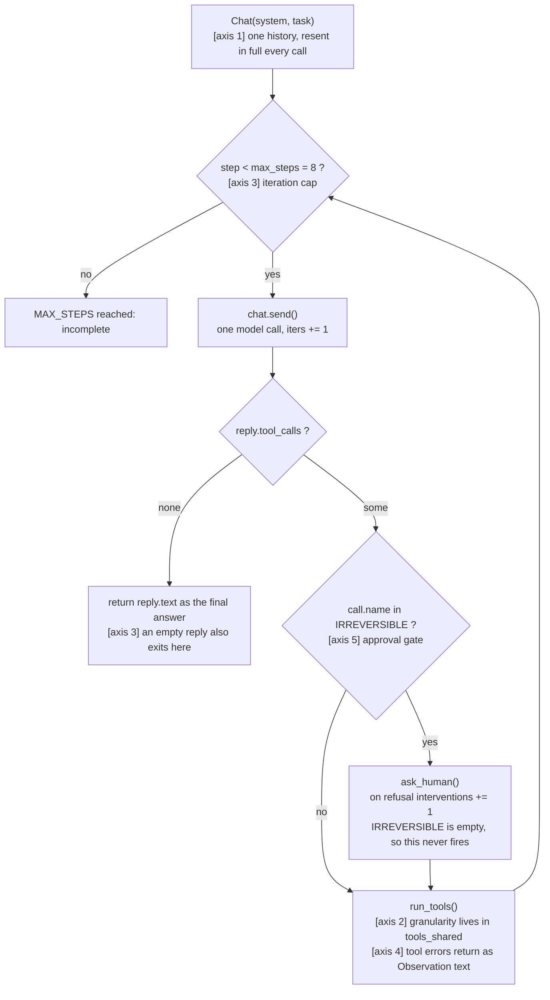
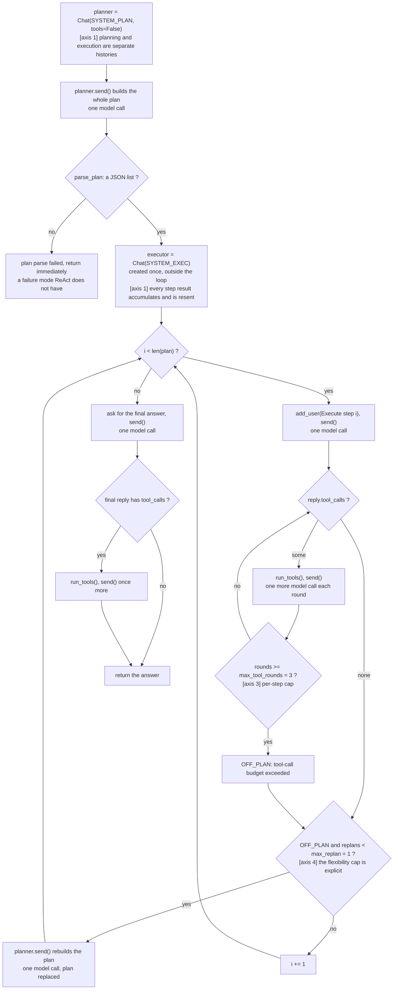

# Week 02 — Harness A/B: ReAct vs Plan-then-Execute

Same model, same task, same tools. Only the harness changes.

## 1. Variant definition

Which of the five axes the two harnesses set differently, and how.

| Axis | ReAct (`harness_react.py`) | Plan-then-Execute (`harness_plan_execute.py`) |
|---|---|---|
| 1. Context management | One `Chat`. The whole history — including the 4000-character file dump — is resent on every call. | Two histories. `planner` never sees tool output; `executor` is created once outside the loop (`:53`), so each step's result accumulates and is resent on the next step. |
| 2. Tool granularity | **Held constant.** Both import `read_file` and `count_pattern` from `tools_shared.py`. What differed is *use*: ReAct only ever called `read_file`; Plan-then-Execute called both. | same |
| 3. Termination | Two conditions: `max_steps = 8`, and "the model made no tool call, so it is done" (`:38`). | The plan's length drives the loop; `max_tool_rounds = 3` caps tool calls inside one step; a separate final call asks for the answer. |
| 4. Error recovery | Tool errors come back as Observation text in the same history. The model decides what to do — there is no explicit cap. | An `OFF_PLAN:` sentinel triggers a rebuild, capped at `max_replan = 1`. A plan that is not valid JSON aborts the run immediately. |
| 5. Human intervention | The hook exists: `IRREVERSIBLE` + `ask_human()`. The starter tools are read-only, so the set is empty and it never fires. | **No hook at all.** Interventions are 0 in both, but for different reasons — one is a wired gate with nothing behind it, the other is an absence. |

### ReAct



### Plan-then-Execute



## 2. Measurements

From `results.csv`. Seconds come from the `[judge]` line of each file in `logs/`.

| run | harness | success | tokens | iters | interventions | seconds | note |
|---|---|---|---|---|---|---|---|
| 1 | react | O | 4,804 | 2 | 0 | 85.2 | 600 s timeout setting |
| 2 | react | O | 3,703 | 2 | 0 | 87.1 | 600 s timeout setting |
| 3 | react | X | 15,317 | 1 | 0 | 600.5 | empty `[final]`; 600 s timeout setting |
| 4 | react | O | 4,572 | 2 | 0 | 114.7 | |
| 5 | react | X | 215 | 1 | 0 | 142.7 | empty `[final]` |
| 6 | react | O | 4,563 | 2 | 0 | 66.7 | |
| 7 | plan_exec | X | — | — | — | 2.6 | crash: 429 free-tier daily cap |
| 8 | plan_exec | X | — | — | — | 1.3 | crash: 429 free-tier daily cap |
| 9 | plan_exec | X | — | — | — | 1.5 | crash: 429 free-tier daily cap |
| 10 | plan_exec | O | 25,993 | 9 | 0 | 237.3 | replans=0 |
| 11 | plan_exec | O | 42,002 | 11 | 0 | 244.2 | replans=0 |
| 12 | plan_exec | X | 14,639 | 1 | 0 | 600.2 | planner returned `''`, plan parse failed |

Runs 7–9 are infrastructure, not harness behaviour: the OpenRouter free tier
allows 50 requests a day and it was already spent. They are kept because failed
runs stay, and excluded from the averages below.

Successful runs only:

| | n | mean tokens | mean iters |
|---|---|---|---|
| react | 4 | **4,410** | **2.0** |
| plan_exec | 2 | 33,998 | 10.0 |
| ratio | | 7.7x | 5.0x |

## 3. Interpretation

<!-- TODO: write one paragraph here yourself. Raw material, all of it checked
     against the logs:

     - Two solution paths existed. ReAct always took the cheap one: read the
       whole file once, count in its head, answer. 2 calls, every time.
       Plan-then-Execute split the same work into 4 planned steps and spent
       9-11 calls on it (logs/plan_exec-10, -11).
     - Tokens are counted as input+output per call (tools_shared.py:69), so a
       resent history is charged again every call. The executor is built once
       outside the step loop, so the 4000-character app.log dump rides along in
       every later step. Axis 1 is what makes the 7.7x, not model verbosity.
     - The same provider event hit both harnesses once: ~600 s, ~15,000 tokens,
       an empty string back (react-03, plan_exec-12). ReAct's axis-3 rule
       ("no tool calls means done") returned that empty string as the final
       answer. Plan-then-Execute's parse_plan gate rejected it and logged
       "not valid JSON: ''". Same failure, only one of them named it.
     - So the two harnesses did not win on the same axis: cheaper on axis 1/2,
       more legible on axis 3/4. Say which you would rather have and why.
-->

## Reproducibility

- **Provider / model:** OpenRouter, `nvidia/nemotron-3.5-lightning:free`, for every run in the table.
- **Tools** (identical for both harnesses, `tools_shared.py:44`):
  - `read_file(path)` — "Read a text file in the working directory (first 4000 characters)."
  - `count_pattern(path, pattern)` — "Count the lines of a text file that match a regular expression."
- **Task and criterion:** `TASK.md`. `expected: 14:00`, verified independently before the runs with
  `awk '/ERROR/{print substr($0,12,2)}' app.log | sort | uniq -c | sort -rn` (hour 14 has 6, the next has 3).
- **How to run:**

```bash
export OPENAI_BASE_URL=https://openrouter.ai/api/v1
export OPENAI_API_KEY=<your openrouter key>
export AGENT_MODEL=nvidia/nemotron-3.5-lightning:free
export AGENT_TIMEOUT=120
unset ANTHROPIC_API_KEY          # tools_shared picks Anthropic if this is set
python run_ab.py --runs 3        # --only react | plan_exec tops up one side
```

### Two conditions that are not clean, stated rather than hidden

1. **The timeout changed mid-experiment.** Runs 1–3 used the SDK default of
   600 s; from run 4 on it is 120 s (`AGENT_TIMEOUT`, commit `2d9e26b`). Runs 4–6
   and 10–12 are the comparable set. Runs 1–2 are included in the react mean
   because they succeeded in 2 calls like every other successful react run;
   dropping them moves the mean from 4,410 to 4,568.
2. **The 120 s cap did not bind.** Run 5 spent 142.7 s on a single call and run
   12 spent 600.2 s on a single call, both under `AGENT_TIMEOUT=120`. The cap is
   passed to the client constructor (`tools_shared.py:110`), so something —
   provider-side keep-alive, SDK retries — is outrunning it. Not diagnosed.
